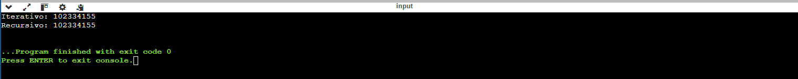
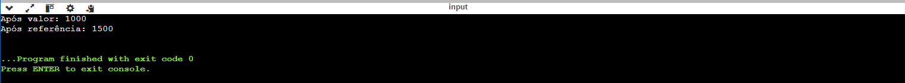
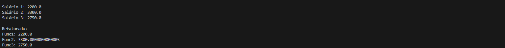
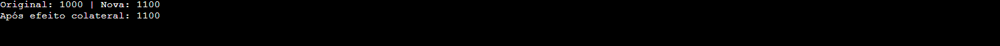
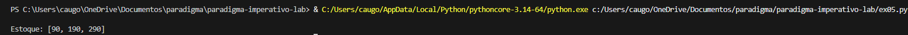
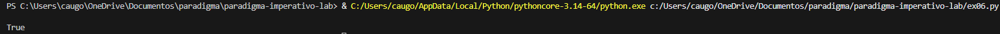
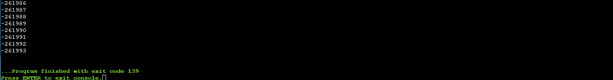
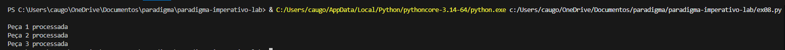
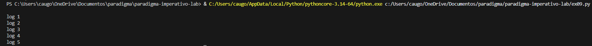
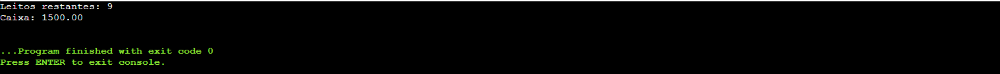

# 🧠 Laboratório Final – Paradigma Imperativo

## 📌 Descrição

Este repositório contém a resolução dos 10 exercícios do laboratório final da disciplina de Paradigma Imperativo.

Os exercícios exploram conceitos fundamentais da programação imperativa, incluindo:

* Controle de fluxo
* Escopo e gerenciamento de memória
* Recursividade
* Efeitos colaterais
* Corrotinas (generators)
* Limitações do paradigma procedural

---

## 📁 Estrutura do Projeto

```bash
laboratorio-paradigma-imperativo/
│
├── README.md
│
├── modulo1/
│   ├── ex01.c
│   ├── ex02.c
│   ├── ex03.py
│
├── modulo2/
│   ├── ex04.c
│   ├── ex05.py
│
├── modulo3/
│   ├── ex06.py
│   ├── ex07.c
│   ├── ex08.py
│   ├── ex09.py
│
├── modulo4/
│   ├── ex10.c
│
└── prints/
    ├── ex01.png
    ├── ex02.png
    ├── ex03.png
    ├── ex04.png
    ├── ex05.png
    ├── ex06.png
    ├── ex07.png
    ├── ex08.png
    ├── ex09.png
    └── ex10.png
```

---

## ▶️ Como executar os programas

### 🔹 Programas em C

Compile e execute com:

```bash
gcc nome_do_arquivo.c -o programa
./programa
```

---

### 🔹 Programas em Python

Execute com:

```bash
python nome_do_arquivo.py
```

---

## 📸 Execução dos Exercícios

### Exercício 1 – Fibonacci (Iterativo vs Recursivo)




### Exercício 2 – Passagem por Valor vs Referência



### Exercício 3 – Refatoração e Abstração Procedural



### Exercício 4 – Efeito Colateral



### Exercício 5 – Call-by-sharing



### Exercício 6 – Recursividade em Estruturas



### Exercício 7 – Stack Overflow



### Exercício 8 – Corrotinas (Yield)



### Exercício 9 – Lazy Evaluation



### Exercício 10 – Limites do Paradigma Procedural



---

## 📊 Análises Implementadas

Cada exercício contém comentários no código explicando:

* Complexidade computacional
* Uso de memória (stack/heap)
* Diferença entre passagem por valor e referência
* Efeitos colaterais
* Funcionamento de recursividade
* Execução com `yield`
* Problemas de acoplamento e estado global

---

## ⚠️ Observações

* Todos os exercícios foram implementados conforme solicitado.
* Os prints comprovam a execução correta dos programas.
* O código contém comentários explicativos conforme exigido na atividade.

---

## 👨‍💻 Autor

Cauan Gomes
